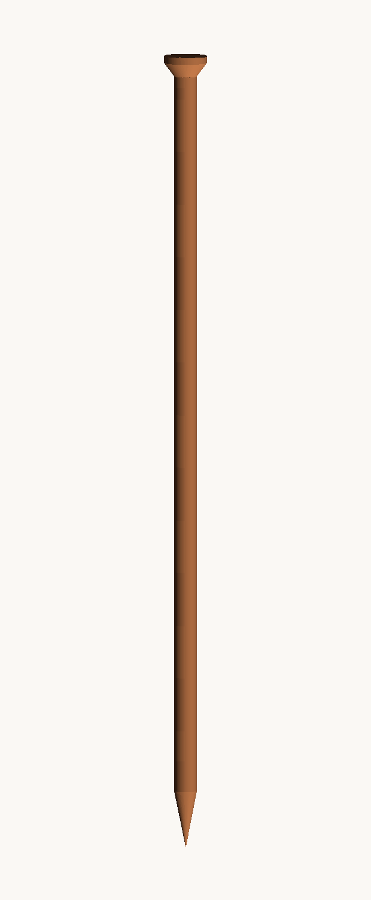

# מחזיק קטורת מתקע — 1.5 מטר

מקל קטורת מודולרי להדפסה תלת־מימדית: נתקע באדמה כמו יתד, ובראשו כתר עם 8 חורים
לקטורות. האורך הכולל בהרכבה — **1500 מ"מ** בדיוק.



## איך זה בנוי

מכיוון שאף מדפסת ביתית לא מדפיסה מטר וחצי, המקל מורכב מ־8 חלקים שנערמים זה על זה:

| # | חלק | כמות | גובה הדפסה | תרומה לגובה |
|---|------|------|------------|--------------|
| 1 | `01_spike.stl` — יתד עם חוד | 1 | 245 מ"מ | 220 מ"מ |
| 2 | `02_segment.stl` — מקטע תורן | **6** | 225 מ"מ | 200 מ"מ כל אחד |
| 3 | `03_head.stl` — כתר עם קערת אפר | 1 | 80 מ"מ | 80 מ"מ |

כל חלק מסתיים בפין זכר (ספיגוט) בקוטר 34.4 מ"מ שנכנס לשקע בתחתית החלק שמעליו,
עם מרווח של 0.3 מ"מ. בכל חיבור יש חור אלכסוני בקוטר 4.2 מ"מ — מכניסים דרכו בורג
M4 או מסמר 4 מ"מ שנועל את החיבור מכנית.

**החלק החשוב ביותר:** במרכז כל החלקים עובר תעלה בקוטר 11 מ"מ. משחילים דרכה
**מוט עץ / צינור אלומיניום בקוטר 10 מ"מ באורך ~1400 מ"מ** — הוא זה שנושא את
מאמצי הכפיפה. פלסטיק לבדו באורך מטר וחצי יישבר ברוח או בנעיצה לאדמה.

## רשימת חומרים

- ~520 גרם פילמנט (PLA / PETG) במילוי 30%
- מוט עץ עגול או צינור אלומיניום ⌀10 מ"מ, אורך 1400 מ"מ
- 7 ברגי M4×50 או מסמרים ⌀4 מ"מ
- דבק אפוקסי (אופציונלי — רק אם לא רוצים לפרק אחר כך)

## הגדרות הדפסה

- שכבה 0.2 מ"מ, 3 מעטפות, מילוי 25–30%
- **בלי תמיכות** — כל החלקים תוכננו כך שאין זווית תלויה מתחת ל־45°
- היתד מודפסת **כשהחוד למעלה** (קובץ ה־STL כבר בכיוון הנכון: הספיגוט על המשטח)
- ראש המדפסת צריך גובה 245 מ"מ. אם המדפסת שלך נמוכה מזה — ראו "התאמות" למטה
- PETG עדיף על PLA לשימוש בחוץ (PLA מתעוות בשמש חזקה)

## הרכבה

1. מרכיבים יבש: יתד → 6 מקטעים → ראש, ומוודאים שהחיבורים יושבים פנים אל פנים.
2. משחילים את המוט המרכזי מלמעלה, דרך כל המקטעים, עד שהוא נעצר בתוך היתד.
3. נועלים כל חיבור בבורג/מסמר דרך שני החורים.
4. בקרקע קשה — קודחים חור מקדים או נועצים מוט ברזל, ורק אז דוחפים את היתד.
   לא להכות בפטיש על הראש.

## שימוש ובטיחות

הקטורות נכנסות ל־8 החורים בקוטר 4.6 מ"מ שבקערה, לעומק 34 מ"מ, בהטיה של 15°
כלפי חוץ — כך הן לא מתנגשות זו בזו והאפר נופל החוצה ולא על הפלסטיק.

PLA מתחיל להתרכך סביב 60°C. הגחלת של הקטורת מתקדמת כלפי מטה לכיוון המחזיק,
לכן: אל תשאירו את הקטורת לבעור עד הסוף בתוך החור. אפשרות טובה יותר — לתחוב
בכל חור שרוול מתכת קצר (למשל צינורית פליז ⌀5 מ"מ) שיבודד את הפלסטיק מהגחלת.
לא להשאיר בוער ללא השגחה, ולא לנעוץ ליד צמחייה יבשה.

## התאמות (הקבצים פרמטריים)

הכול נוצר מ־`generate.py`. משנים קבוע בראש הקובץ ומריצים מחדש:

```bash
pip install trimesh manifold3d numpy
python3 generate.py            # יוצר מחדש את קבצי ה־STL
python3 preview.py             # יוצר את תמונות התצוגה (דורש pillow)
```

קבועים שימושיים:

- `SEG_LEN` / `SEG_COUNT` — אורך מקטע ומספר המקטעים. שמרו על
  `SPIKE_LEN + SEG_COUNT*SEG_LEN + HEAD_LEN = 1500`.
  למדפסת נמוכה: `SEG_LEN = 150` עם `SEG_COUNT = 8`.
- `R_OUT` — עובי התורן (ברירת מחדל ⌀42 מ"מ)
- `R_CORE` — קוטר תעלת המוט המרכזי (5.5 = מוט 10 מ"מ)
- `STICK_D`, `STICK_N`, `STICK_TILT` — קוטר, מספר וזווית חורי הקטורת
- `R_SPIG` — הידוק החיבורים. יוצא רופף? העלו ל־17.3. תקוע? הורידו ל־17.1.
